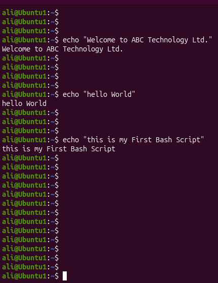
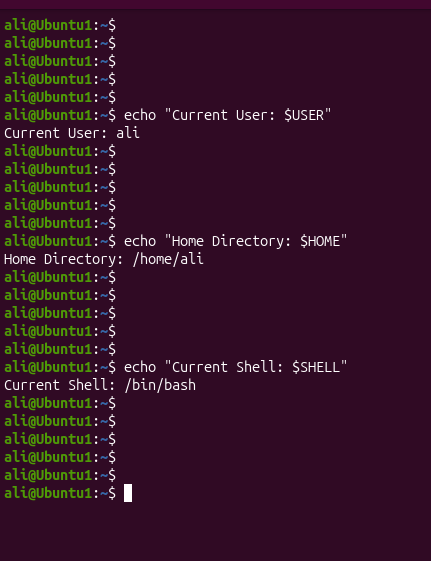
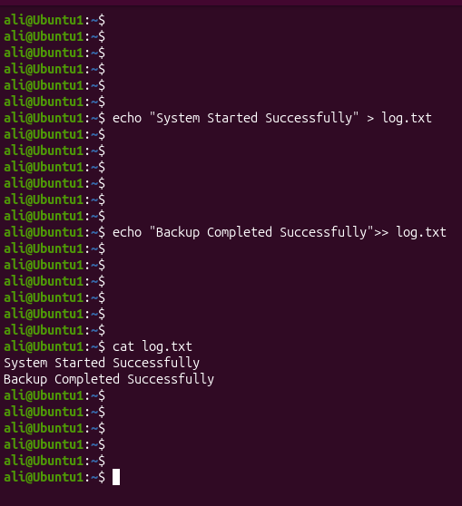

# Linux Project 01 - echo Command

## Objective

Learn how to use the `echo` command to display text and create simple Bash scripts.

---

## Scenario

You are a Junior Linux System Administrator.

Your manager asks you to practice the `echo` command before working on company servers.

---

## What is echo?

The `echo` command displays text or variables in the terminal.

### Syntax

```bash
echo [OPTION] [TEXT]
```

Example

```bash
echo "Hello World"
```

Output

```
Hello World
```

---

## Project Files

- project1.sh - Basic echo
- project2.sh - Echo with variables
- project3.sh - Echo with files

---

## Screenshots

### Project 1



---

### Project 2



---

### Project 3



---

## What I Learned

- Use the `echo` command
- Display text
- Display variables
- Write text into files