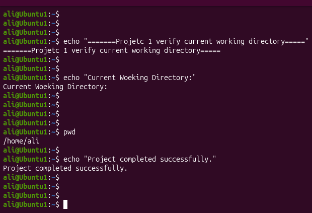
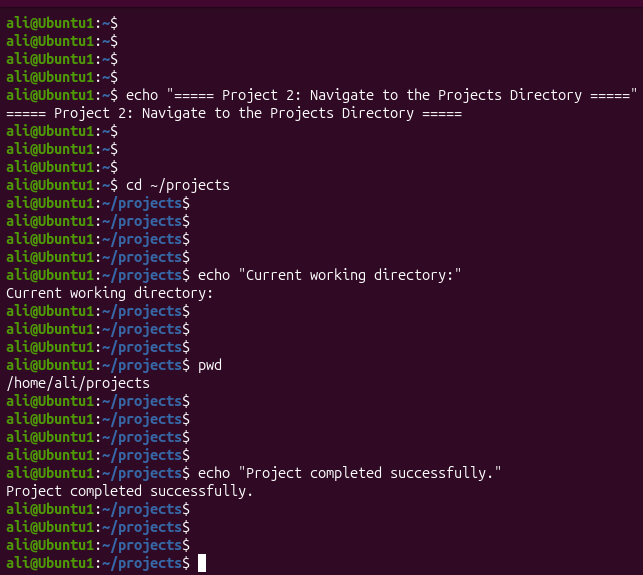
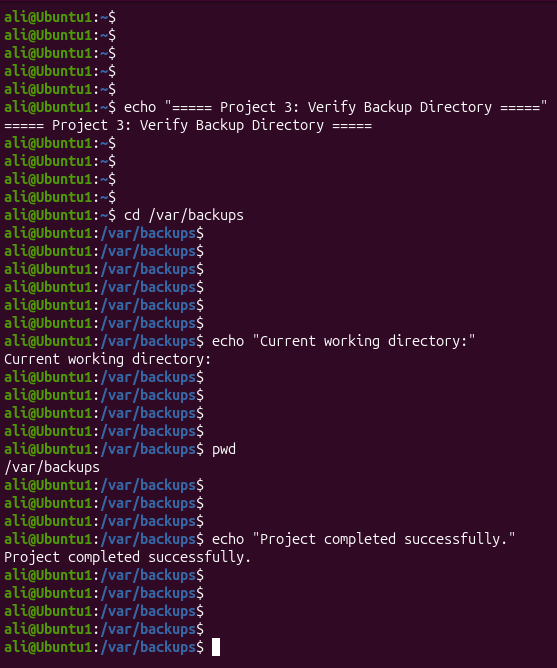

# Linux Project 02 - pwd (Print Working Directory)

## Description

In a real-world Linux environment, system administrators, DevOps engineers, and IT support staff work with hundreds of files and directories every day. 

Before creating, editing, copying, or deleting files, it is important to know the current working directory to avoid making changes in the wrong location.

The `pwd` command helps administrators verify their current location in the Linux filesystem. It is one of the first commands used before performing many 

administrative tasks on Linux servers.

---

## Objective

Learn how to use the `pwd` command to identify your current working directory and understand how it helps you navigate the Linux filesystem safely.

---

## Company Scenario

You have recently joined **TechSolutions Ltd.** as a **Junior Linux System Administrator**.

Your team manages multiple Linux servers that contain application files, configuration files, user data, and backup directories.

Before performing any maintenance, your manager instructs you to always verify your current working directory using the `pwd` command to prevent accidental 

modifications to important system files.

Your task is to complete the following practice projects.

---

## What is `pwd`?

The `pwd` (**Print Working Directory**) command displays the absolute path of your current working directory.

### Syntax

```bash

pwd

```

### Example

```bash

pwd

```

### Output

```text

/home/ali

```

---

## Project 1 – Verify Your Current Working Directory

### Task

Log in to the Linux server and verify your current location before starting any administrative task.

### Commands

```bash
pwd

```

### Expected Output

```text

/home/ali

```

---

## Project 2 – Navigate to the Company Projects Directory

### Task

The development team asks you to verify that you are inside the company's projects directory before editing project files.

### Commands

```bash

cd ~/projects

pwd

```

### Expected Output

```text

/home/ali/projects

```

---

## Project 3 – Verify the Backup Directory Before Copying Files

### Task

Before copying important company data into the backup folder, confirm that you are inside the correct backup directory.

### Commands

```bash

cd /var/backups

pwd

```

### Expected Output

```text

/var/backups

```

---

## Screenshots

### Project 1



---

### Project 2



---

### Project 3



---

## What I Learned

* Use the `pwd` command to display the current working directory.

* Understand the difference between absolute and relative paths.

* Verify the current directory before performing administrative tasks.

* Navigate the Linux filesystem with confidence.

* Follow real-world Linux administration best practices.
