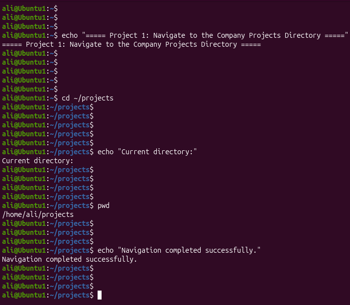
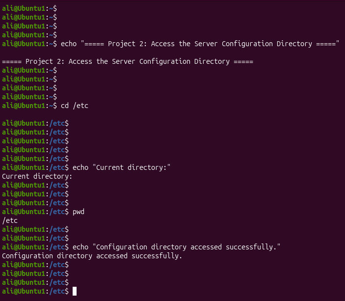
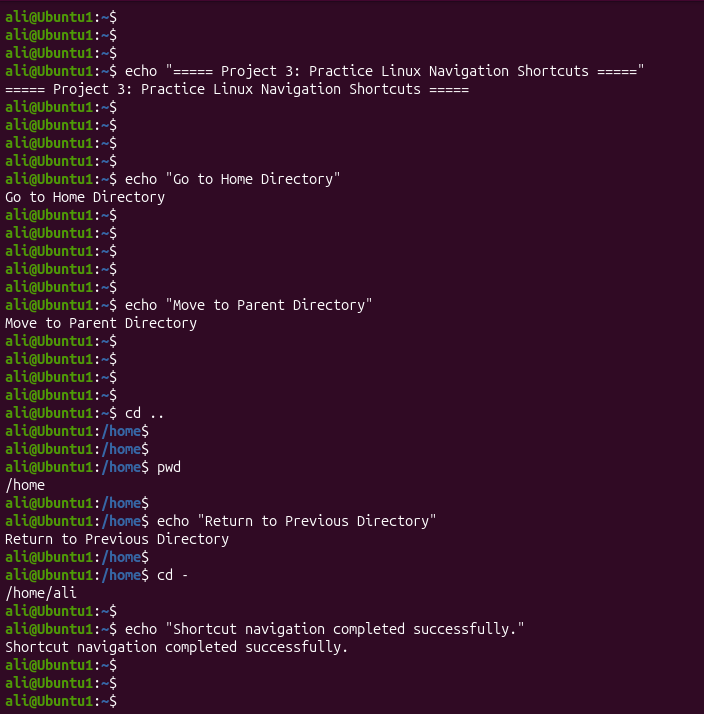

# Linux Project 03 - cd (Change Directory)

## Description

Linux system administrators spend much of their time navigating through the filesystem to manage applications, configuration files, user data, logs, and backups. Efficient navigation is an essential skill because administrative tasks often require moving between multiple directories.

The `cd` (**Change Directory**) command allows users to move from one directory to another. Mastering this command makes working in Linux faster, easier, 
and more efficient.

---

## Objective

Learn how to use the `cd` command to navigate the Linux filesystem using absolute paths, relative paths, and common navigation shortcuts.

---

## Company Scenario

You have joined **TechSolutions Ltd.** as a **Junior Linux System Administrator**.

Your manager asks you to perform daily maintenance on the company's Linux servers. Before editing configuration files, checking logs, or creating backups, 

you must navigate to the correct directories using the `cd` command.

Complete the following tasks to demonstrate your Linux navigation skills.

---

## What is `cd`?

The `cd` (**Change Directory**) command changes the current working directory.

### Syntax

```bash

cd [DIRECTORY]

```

---

## Understanding Paths

### Absolute Path

An absolute path starts from the root directory (`/`).

Example:

```text

/home/ali/Documents

```

### Relative Path

A relative path starts from your current directory.

Example:

```text

Documents

```

---

## Project 1 – Navigate to the Company Projects Directory

### Task

The development team asks you to access the company's project folder before updating application files.

### Commands

```bash

cd ~/projects

pwd

```

### Expected Output

```text

/home/ali/projects

```

---

## Project 2 – Access the Server Configuration Directory

### Task

Your manager asks you to verify server configuration files stored in the Linux configuration directory.

### Commands

```bash

cd /etc

pwd

```

### Expected Output

```text

/etc

```

---

## Project 3 – Use Linux Navigation Shortcuts

### Task

Practice using Linux navigation shortcuts to improve your efficiency.

### Commands

```bash
cd ~

pwd

cd ..

pwd

cd -

pwd

```

### Expected Output

The output depends on your current and previous directories, but each `pwd` command should display your current location after navigation.

---

## Screenshots

### Project 1



---

### Project 2



---

### Project 3



---

## What I Learned

* Navigate between directories using the `cd` command.

* Understand absolute and relative paths.

* Use Linux navigation shortcuts (`~`, `.`, `..`, and `-`).

* Verify directory changes using the `pwd` command.

* Navigate efficiently in a real Linux administration environment.
