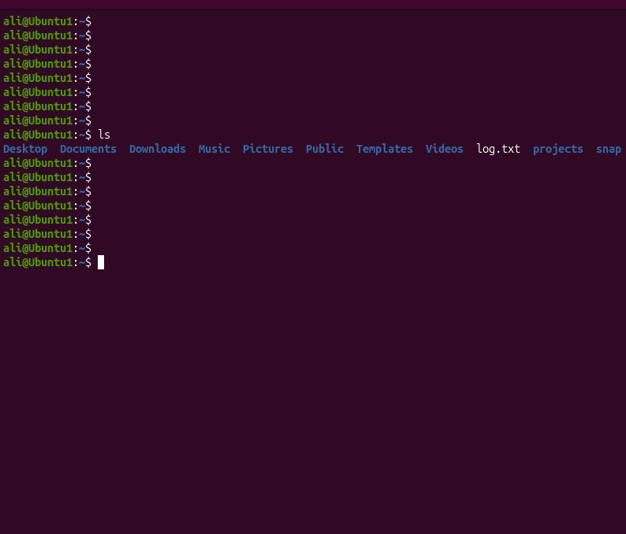
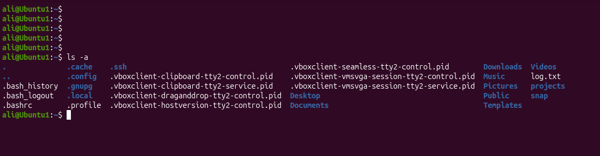
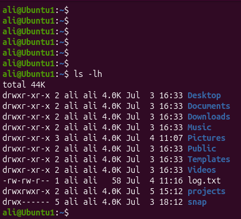

# Linux Project 04 - ls (List Files and Directories)

## Description

Linux administrators frequently need to view files and directories before managing systems, editing configuration files, or checking logs.

The `ls` (**List**) command displays the contents of a directory. It is one of the most commonly used Linux commands for exploring the filesystem.

---

## Objective

Learn how to use the `ls` command to list files and directories, display hidden files, and view detailed file information.

---

## Company Scenario

You have joined **TechSolutions Ltd.** as a **Junior Linux System Administrator**.

Your manager asks you to inspect different directories on the company's Linux server before performing maintenance. You must use the `ls` command to verify files and directories.

Complete the following tasks to demonstrate your Linux file listing skills.

---

## What is `ls`?

The `ls` (**List**) command displays the contents of a directory.

### Syntax

```bash
ls [OPTION] [DIRECTORY]
```

---

## Essential `ls` Options

| Option | Description |
|---------|-------------|
| `-a` | Show hidden files. |
| `-l` | Display detailed information. |
| `-h` | Show human-readable file sizes (used with `-l`). |

---

## Project 1 – List Files in the Current Directory

### Task

Your manager asks you to check the contents of your current working directory.

### Commands

```bash
ls
```

### Expected Output

```text
Desktop  Documents  Downloads  Music  Pictures  Videos
```

---

## Project 2 – View Hidden Files

### Task

You need to verify hidden configuration files in your home directory.

### Commands

```bash
ls -a
```

### Expected Output

```text
.  ..  .bashrc  .profile  Desktop  Documents
```

---

## Project 3 – Display Detailed File Information

### Task

Your manager asks you to check file permissions, owners, and file sizes.

### Commands

```bash
ls -lh
```

### Expected Output

```text
drwxr-xr-x 2 ali ali 4.0K Documents
-rw-r--r-- 1 ali ali 1.2K notes.txt
```

---

## Screenshots

### Project 1



---

### Project 2



---

### Project 3



---

## What I Learned

- List files and directories using the `ls` command.
- Display hidden files using `ls -a`.
- View detailed file information with `ls -lh`.
- Inspect directories before performing Linux administration tasks.