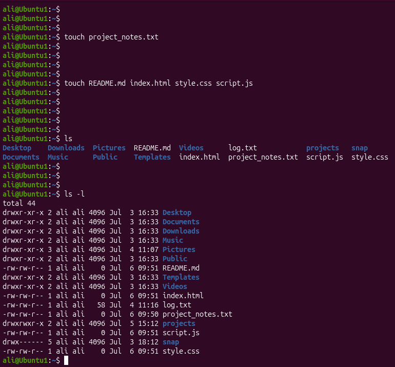
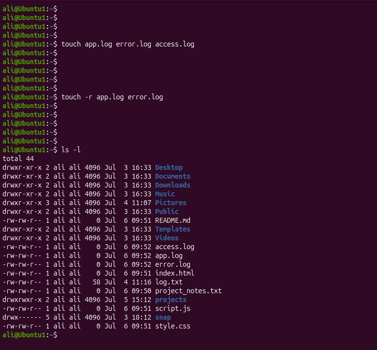
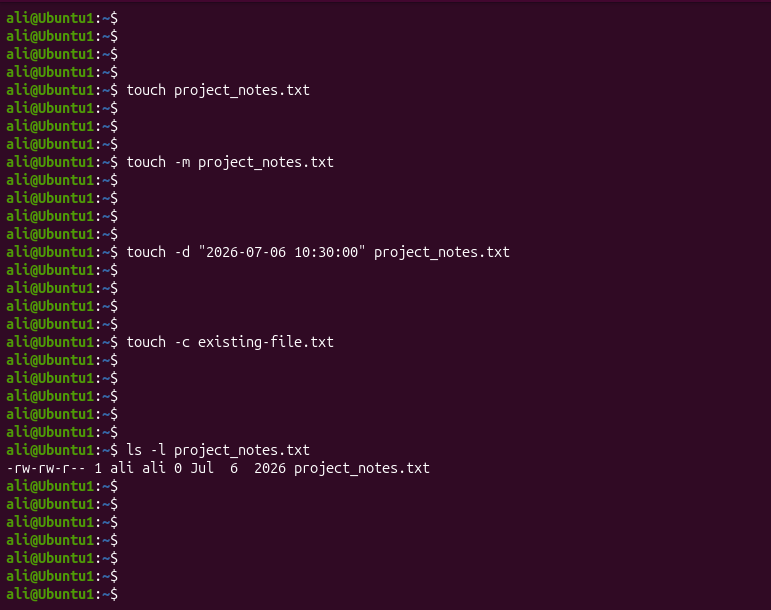

# Linux Project 05 - touch (Create Files)

## Description

Linux administrators frequently create files for configuration, documentation, scripts, logs, and application data. Before adding any content, empty files are often created as placeholders or to prepare a project structure.

The `touch` command is used to create empty files and update the timestamps of existing files without modifying their contents. It is one of the most commonly used Linux commands in system administration.

---

## Objective

Learn how to use the `touch` command to:

- Create new files.
- Create multiple files at once.
- Update file timestamps.
- Copy timestamps from one file to another.
- Set a custom date and time for a file.
- Verify file creation and timestamps.

---

## Company Scenario

You have joined **TechSolutions Ltd.** as a **Junior Linux System Administrator**.

Your manager asks you to prepare files for a new software project. You need to create project files, prepare log files, update timestamps, and verify that everything has been created correctly before the development team starts working.

Complete the following tasks to demonstrate your Linux file management skills using the `touch` command.

---

## What is `touch`?

The `touch` command creates empty files if they do not exist. If the file already exists, the command updates its access and modification timestamps without changing its contents.

### Syntax

```bash
touch [OPTION] FILE...
```

---

## Essential `touch` Options

| Option | Description |
|---------|-------------|
| `-c` | Do not create the file if it does not exist. |
| `-d` | Set a specific date and time. |
| `-r` | Copy the timestamp from another file. |
| `-m` | Update only the modification time. |

---

# Project 1 – Create Project Files

## Task

Your manager asks you to prepare the documentation and source files for a new company application. Create the required files and verify that they were created successfully.

### Commands

```bash
touch project_notes.txt

touch README.md index.html style.css script.js

ls

ls -l
```

### Expected Output

```text
README.md
index.html
project_notes.txt
script.js
style.css
```

---

# Project 2 – Create Log Files and Copy Timestamps

## Task

The development team requests several log files for testing. After creating them, copy the timestamp from one file to another and verify the changes.

### Commands

```bash
touch app.log error.log access.log

touch -r app.log error.log

ls

ls -l
```

### Expected Output

```text
access.log
app.log
error.log
```

---

# Project 3 – Update File Timestamps

## Task

Your manager asks you to update the timestamp of an existing file, assign a custom date and time, ensure a missing file is not created, and verify the results.

### Commands

```bash
touch project_notes.txt

touch -m project_notes.txt

touch -d "2026-07-06 10:30:00" project_notes.txt

touch -c existing-file.txt

ls -l project_notes.txt
```

### Expected Output

```text
-rw-r--r-- 1 ali ali 0 Jul 6 10:30 project_notes.txt
```

---

## Screenshots

### Project 1



---

### Project 2



---

### Project 3



---

## What I Learned

- Create empty files using the `touch` command.
- Create multiple files with a single command.
- Update file timestamps without changing file contents.
- Copy timestamps from one file to another.
- Set a specific date and time for a file.
- Verify file creation and timestamps using the `ls` command.