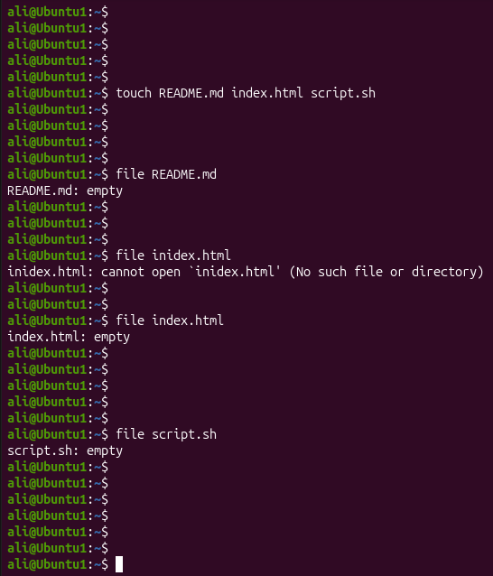
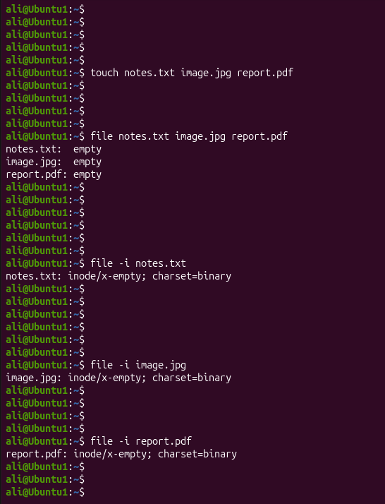
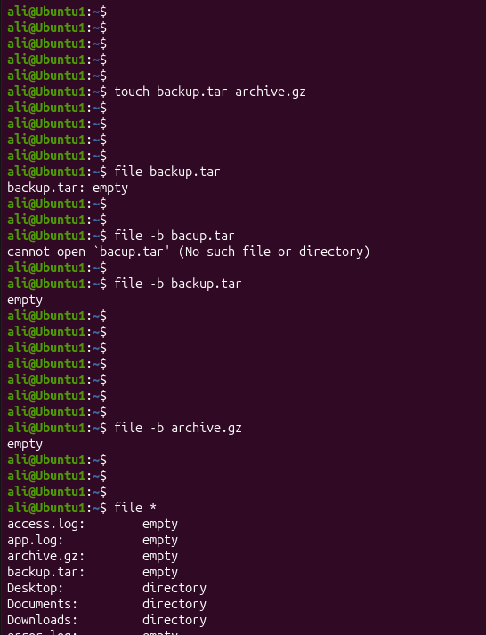

# Linux Project 06 - file (Identify File Types)

## Description

Linux administrators often work with different types of files such as text files, images, scripts, compressed files, and executable programs. Before opening or processing a file, it is important to identify its actual file type.

The `file` command examines a file's contents and displays information about its type instead of relying only on its filename or extension.

---

## Objective

Learn how to use the `file` command to:

- Identify file types.
- Check multiple files at once.
- Display MIME type information.
- Use wildcards to inspect multiple files.
- Display brief file information.

---

## Company Scenario

You have joined **TechSolutions Ltd.** as a **Junior Linux System Administrator**.

Your manager asks you to verify several project files before they are uploaded to the company server. Some files may have incorrect extensions, so you must use the `file` command to determine their actual file types.

Complete the following tasks to demonstrate your Linux file identification skills.

---

## What is `file`?

The `file` command determines the type of a file by examining its contents rather than relying only on its filename or extension.

### Syntax

```bash
file [OPTION] FILE
```

---

## Essential `file` Options

| Option | Description |
|---------|-------------|
| `-i` | Display the MIME type of a file. |
| `-b` | Display only the file type without the filename. |
| `-L` | Follow symbolic links. |
| `-z` | Examine compressed files. |

---

# Project 1 – Identify Project Files

## Task

Your manager asks you to verify the file types of the company's project files before deployment.

### Commands

```bash
touch README.md index.html script.sh

file README.md

file index.html

file script.sh

file *
```

### Expected Output

```text
README.md: empty
index.html: empty
script.sh: empty
```

---

# Project 2 – Check Multiple Files and MIME Types

## Task

Verify the types of several files and display their MIME type information.

### Commands

```bash
touch notes.txt image.jpg report.pdf

file notes.txt image.jpg report.pdf

file -i notes.txt

file -i image.jpg

file -i report.pdf
```

### Expected Output

```text
notes.txt: empty
image.jpg: empty
report.pdf: empty
```

---

# Project 3 – Display Brief Information

## Task

Display brief file information, inspect all project files, and verify the file types.

### Commands

```bash
touch backup.tar archive.gz

file -b backup.tar

file -b archive.gz

file *

ls -l
```

### Expected Output

```text
empty
empty
```

---

## Screenshots

### Project 1



---

### Project 2



---

### Project 3



---

## What I Learned

- Identify file types using the `file` command.
- Check multiple files at the same time.
- Display MIME type information using `file -i`.
- Display brief output using `file -b`.
- Inspect all files using wildcards (`*`).
- Verify file types before using or deploying files.