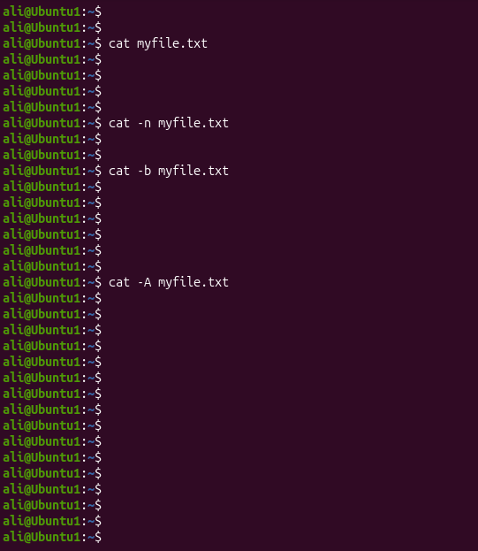
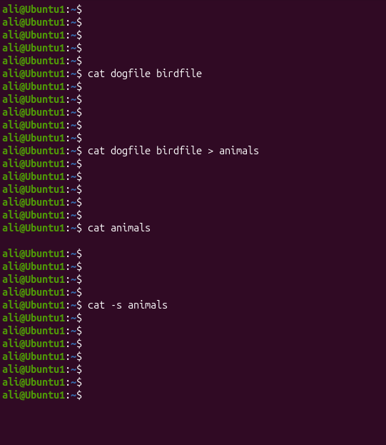
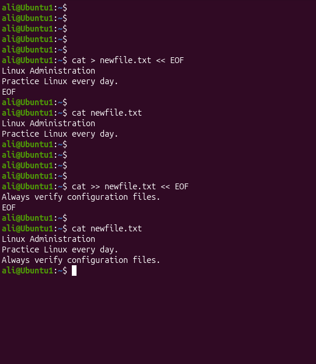

# Linux Project 07 - cat (Concatenate)

## Description

In a real-world Linux environment, system administrators, DevOps engineers, and IT support staff frequently read configuration files, log files, and reports.

The `cat` command helps administrators quickly display file contents, combine multiple files, create new files, and inspect text files directly from the terminal. It is one of the most commonly used Linux commands.

---

## Objective

Learn how to use the `cat` command to display, combine, create, and inspect text files safely in Linux.

---

## Company Scenario

You have recently joined **TechSolutions Ltd.** as a **Junior Linux System Administrator**.

Your team manages Linux servers containing configuration files, reports, log files, and user documents.

Your manager asks you to use the `cat` command to verify file contents, combine reports, create documentation files, and inspect text files before making changes.

Your task is to complete the following practice projects.

---

## What is `cat`?

The `cat` (**Concatenate**) command is used to display file contents, combine files, create new files, and inspect text files.

### Syntax

```bash
cat [OPTION] FILE
```

### Example

```bash
cat notes.txt
```

### Output

```text
Linux Administration
Practice every day.
```

---

# Project 1 – View and Inspect File Contents

### Task

Before editing a configuration file, display its contents and inspect it using different `cat` options.

### Commands

```bash
cat myfile.txt

cat -n myfile.txt

cat -b myfile.txt

cat -A myfile.txt
```

### Expected Output

```text
This is my first Linux file.
Welcome to Linux.
```

---

# Project 2 – Combine Multiple Files

### Task

The development team asks you to combine two report files into one file and verify the result.

### Commands

```bash
cat dogfile birdfile

cat dogfile birdfile > animals

cat animals

cat -s animals
```

### Expected Output

```text
Contents of dogfile
Contents of birdfile
```

---

# Project 3 – Create, Append and Review a File

### Task

Create a new file, append additional information, verify the contents, and review the file safely.

### Commands

```bash
cat > newfile.txt
```

Type:

```text
Linux Administration
Practice Linux every day.
```

Press:

```text
Ctrl + D
```

Append more text:

```bash
cat >> newfile.txt
```

Type:

```text
Always verify configuration files.
```

Press:

```text
Ctrl + D
```

Display the file:

```bash
cat newfile.txt

less newfile.txt
```

### Expected Output

```text
Linux Administration
Practice Linux every day.
Always verify configuration files.
```

---

## Screenshots

### Project 1



---

### Project 2



---

### Project 3



---

## What I Learned

- Use the `cat` command to display file contents.

- Combine multiple files into one file.

- Create a new file using output redirection (`>`).

- Append data to an existing file using (`>>`).

- Number all lines with `cat -n`.

- Number only non-empty lines with `cat -b`.

- Remove repeated blank lines using `cat -s`.

- Display hidden characters using `cat -A`.

- Use `less` to safely view large files.

- Follow Linux file management best practices.