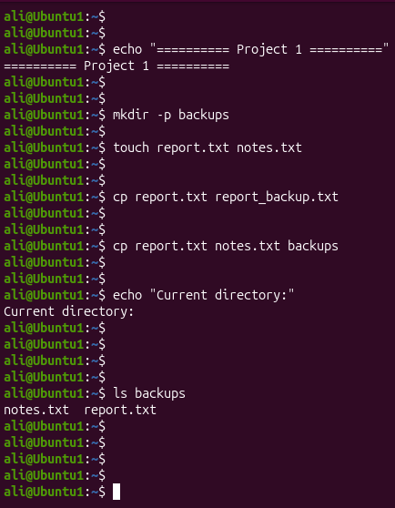
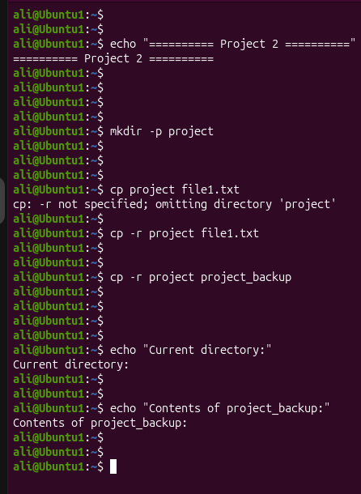
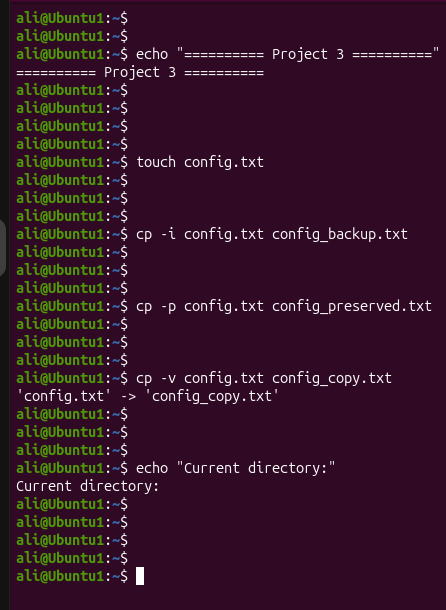

# Linux Project 10 - cp (Copy)

## Description

In a real-world Linux environment, system administrators, DevOps engineers, and IT support staff frequently copy files, create backups, duplicate configuration files, and transfer directories between locations.

The `cp` command allows administrators to safely copy files and directories while preserving important file attributes when needed. It is one of the most commonly used Linux commands for file management and backups.

---

## Objective

Learn how to use the `cp` command to copy files, copy directories, create backups, and preserve file attributes in Linux.

---

## Company Scenario

You have recently joined **TechSolutions Ltd.** as a **Junior Linux System Administrator**.

Your team manages Linux servers that contain configuration files, reports, application data, and backup directories.

Your manager asks you to use the `cp` command to create backups, copy multiple files, duplicate directories, and safely protect existing files from accidental overwrites.

Your task is to complete the following practice projects.

---

## What is `cp`?

The `cp` (**Copy**) command is used to copy files and directories from one location to another.

### Syntax

```bash
cp [OPTION] SOURCE DESTINATION
```

### Example

```bash
cp notes.txt backup_notes.txt
```

### Output

```text
(The file is copied successfully.)
```

---

# Project 1 – Copy Files

### Task

Copy individual files, copy multiple files into a directory, and verify the copied files.

### Commands

```bash
mkdir backups

touch report.txt notes.txt

cp report.txt report_backup.txt

cp report.txt notes.txt backups/

ls

ls backups
```

### Expected Output

```text
backups
notes.txt
report.txt
report_backup.txt
```

Inside the backups directory:

```text
notes.txt
report.txt
```

---

# Project 2 – Copy Directories

### Task

Copy an entire directory recursively and verify the copied directory.

### Commands

```bash
mkdir project

touch project/file1.txt

touch project/file2.txt

cp -r project project_backup

ls

ls project_backup
```

### Expected Output

```text
project
project_backup
```

Inside project_backup:

```text
file1.txt
file2.txt
```

---

# Project 3 – Safe Copy and Preserve Attributes

### Task

Protect existing files from accidental overwriting, preserve file attributes, and display copied files.

### Commands

```bash
touch config.txt

cp -i config.txt config_backup.txt

cp -p config.txt config_preserved.txt

cp -v config.txt config_copy.txt

ls
```

### Expected Output

```text
'config.txt' -> 'config_copy.txt'
```

Files:

```text
config.txt
config_backup.txt
config_copy.txt
config_preserved.txt
```

---

## Screenshots

### Project 1



---

### Project 2



---

### Project 3



---

## What I Learned

- Copy a file using `cp`.
- Copy a file with a new name.
- Copy multiple files into a directory.
- Copy directories recursively using `cp -r`.
- Protect existing files using `cp -i`.
- Preserve timestamps and permissions using `cp -p`.
- Display copied files using `cp -v`.
- Verify copied files using `ls`.
- Follow Linux backup and file management best practices.