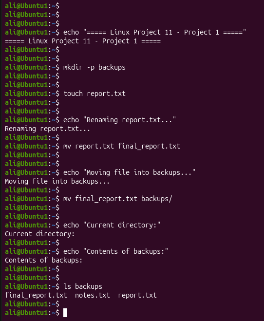
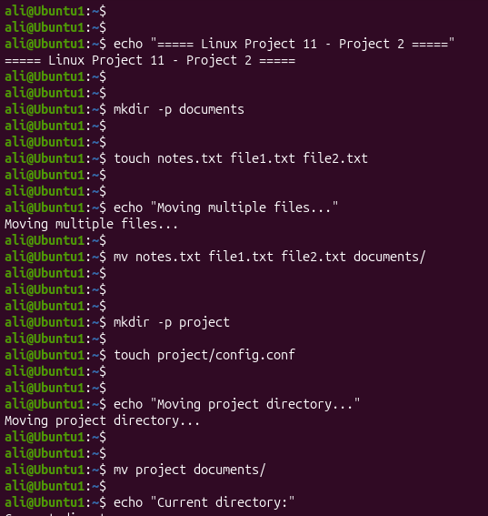
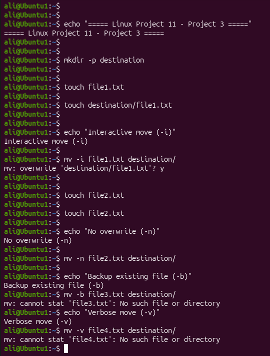

# Linux Project 11 - mv (Move)

## Description

In a real-world Linux environment, system administrators, DevOps engineers, and IT support staff frequently move files between directories, rename files and folders, organize project files, and archive data.

The `mv` command allows administrators to move files and directories from one location to another or rename them without creating duplicate copies. It is one of the most commonly used Linux commands for file management and organization.

---

## Objective

Learn how to use the `mv` command to move files, rename files and directories, move multiple files, and safely prevent accidental overwriting.

---

## Company Scenario

You have recently joined **TechSolutions Ltd.** as a **Junior Linux System Administrator**.

Your team manages Linux servers containing configuration files, application logs, reports, and backup folders.

Your manager asks you to organize project files by renaming them, moving them into backup directories, relocating project folders, and protecting existing files from accidental overwrites.

Your task is to complete the following practice projects.

---

## What is `mv`?

The `mv` (**Move**) command is used to move files and directories from one location to another or rename them.

Unlike the `cp` command, the `mv` command does **not** create a copy. It moves the original file or directory.

### Syntax

```bash
mv [OPTION] SOURCE DESTINATION
```

### Example

```bash
mv report.txt reports/
```

### Output

```text
(The file is moved successfully.)
```

---

# Project 1 – Rename and Move Files

### Task

Rename a file, move a file into another directory, and verify the changes.

### Commands

```bash
mkdir backups

touch report.txt

mv report.txt final_report.txt

mv final_report.txt backups/

ls

ls backups
```

### Expected Output

Current directory:

```text
backups
```

Inside backups:

```text
final_report.txt
```

---

# Project 2 – Move Multiple Files and Directories

### Task

Move multiple files into a directory and move an entire project directory.

### Commands

```bash
mkdir documents

touch notes.txt file1.txt file2.txt

mv notes.txt file1.txt file2.txt documents/

mkdir project

touch project/config.conf

mv project documents/

ls

ls documents

ls documents/project
```

### Expected Output

Current directory:

```text
documents
```

Inside documents:

```text
file1.txt
file2.txt
notes.txt
project
```

Inside documents/project:

```text
config.conf
```

---

# Project 3 – Safe Move Operations

### Task

Prevent accidental overwriting, create backups before overwriting, display move operations, and verify the results.

### Commands

```bash
mkdir destination

touch file1.txt

touch destination/file1.txt

mv -i file1.txt destination/

touch file2.txt

mv -n file2.txt destination/

touch file3.txt

touch destination/file3.txt

mv -b file3.txt destination/

touch file4.txt

mv -v file4.txt destination/

ls destination
```

### Expected Output

```text
'file4.txt' -> 'destination/file4.txt'
```

Inside destination:

```text
file1.txt
file2.txt
file3.txt
file3.txt~
file4.txt
```

---

## Screenshots

### Project 1



---

### Project 2



---

### Project 3



---

## What I Learned

* Move files using `mv`.
* Rename files and directories.
* Move multiple files into another directory.
* Move entire directories without using `-r`.
* Prevent overwriting using `mv -n`.
* Ask before overwriting using `mv -i`.
* Create backup copies before overwriting using `mv -b`.
* Display move operations using `mv -v`.
* Verify moved files using `ls`.
* Follow Linux file organization and management best practices.
