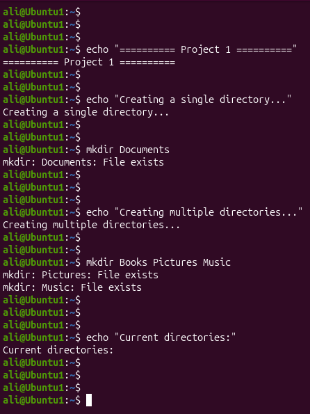
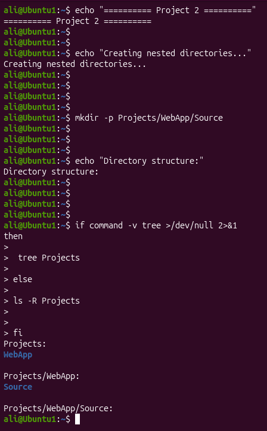
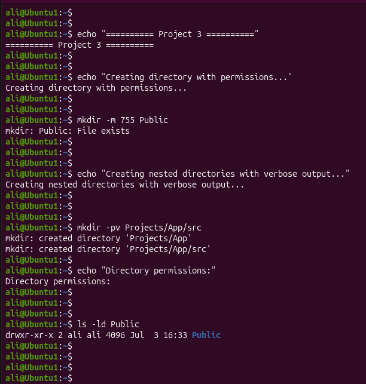

# Linux Project 12 - mkdir (Make Directory)

## Description

In a real-world Linux environment, system administrators, DevOps engineers, and IT support staff create directories to organize files, application data, backups, scripts, and configuration files.

The `mkdir` command allows administrators to create one or more directories, build nested directory structures, and set directory permissions during creation.

---

## Objective

Learn how to use the `mkdir` command to create single directories, multiple directories, nested directories, and directories with specific permissions.

---

## Company Scenario

You have recently joined **TechSolutions Ltd.** as a **Junior Linux System Administrator**.

Your team is preparing a new Linux server for hosting applications and storing project files.

Your manager asks you to use the `mkdir` command to create project folders, organize nested directory structures, and assign permissions to newly created directories.

Your task is to complete the following practice projects.

---

## What is `mkdir`?

The `mkdir` command (Make Directory) is used to create new directories in Linux.

### Syntax

```bash
mkdir [OPTIONS] DIRECTORY...
```

### Example

```bash
mkdir Documents
```

---

# Project 1 – Create Single and Multiple Directories

## Task

Create one directory and then create multiple directories with a single command.

## Commands

Create a single directory.

```bash
mkdir Documents
```

Create multiple directories.

```bash
mkdir Books Pictures Music
```

Verify the directories.

```bash
ls
```

---

# Project 2 – Create Nested Directories

## Task

Create a complete directory structure using the `-p` option.

## Commands

```bash
mkdir -p Projects/WebApp/Source
```

Verify the directory structure.

```bash
tree Projects
```

If the `tree` command is not installed, use:

```bash
ls -R Projects
```

---

# Project 3 – Create Directories with Options

## Task

Create directories using advanced `mkdir` options.

## Commands

Create a directory with specific permissions.

```bash
mkdir -m 755 Public
```

Create nested directories and display each created directory.

```bash
mkdir -pv Projects/App/src
```

Example output:

```text
mkdir: created directory 'Projects'
mkdir: created directory 'Projects/App'
mkdir: created directory 'Projects/App/src'
```

Verify permissions.

```bash
ls -ld Public
```

---

## Screenshots

### Project 1



---

### Project 2



---

### Project 3



---

## What I Learned

* Use the `mkdir` command to create directories.
* Create multiple directories with a single command.
* Create nested directories using the `-p` option.
* Set directory permissions during creation using `-m`.
* Display each created directory using the `-v` option.
* Verify directory structures and permissions.
* Organize files and projects efficiently using directories.