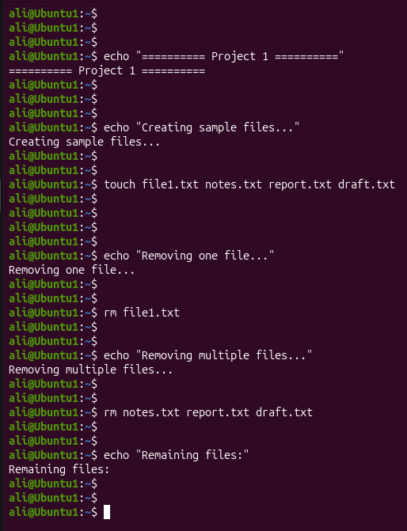
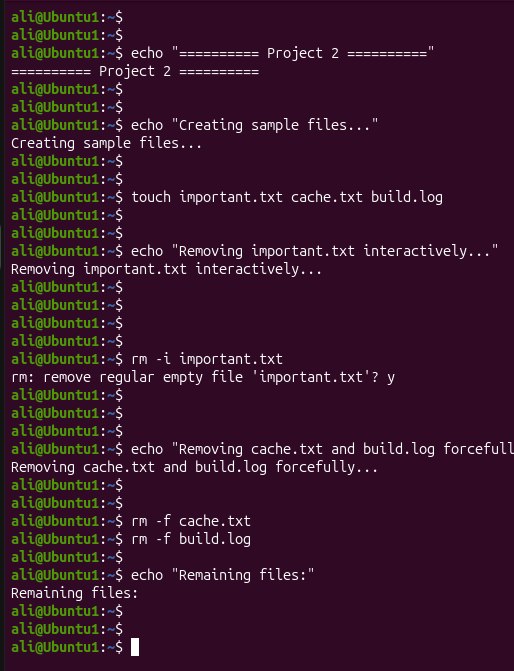
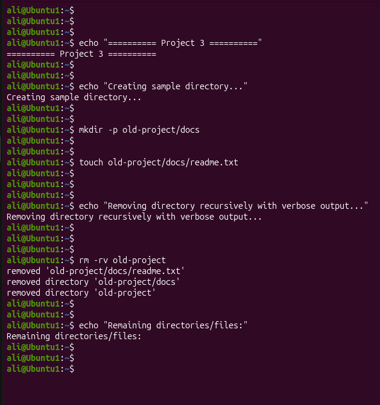

# Linux Project 13 - rm (Remove Files and Directories)

## Description

In a real-world Linux environment, system administrators, DevOps engineers, and IT support staff regularly remove unnecessary files, old logs, temporary files, and unused directories to keep systems organized and save disk space.

The `rm` command allows administrators to safely remove files and directories while providing options for interactive deletion, force deletion, recursive deletion, and verbose output.

---

## Objective

Learn how to use the `rm` command to remove files, delete multiple files, remove directories recursively, and safely delete files using different command options.

---

## Company Scenario

You have recently joined **TechSolutions Ltd.** as a **Junior Linux System Administrator**.

Your team manages Linux servers that generate temporary files, log files, and old project directories.

Your manager asks you to clean up unnecessary files and directories using the `rm` command while practicing safe deletion techniques.

Your task is to complete the following practice projects.

---

## What is `rm`?

The `rm` command (Remove) is used to delete files and directories from a Linux system.

### Syntax

```bash
rm [OPTIONS] FILE...
```

### Example

```bash
rm file1.txt
```

---

# Project 1 – Remove Single and Multiple Files

## Task

Create sample files and remove one file, then remove multiple files.

## Commands

Create sample files.

```bash
touch file1.txt notes.txt report.txt draft.txt
```

Remove a single file.

```bash
rm file1.txt
```

Remove multiple files.

```bash
rm notes.txt report.txt draft.txt
```

Verify the files have been removed.

```bash
ls
```

---

# Project 2 – Remove Files Using Options

## Task

Practice interactive deletion and force deletion.

## Commands

Create sample files.

```bash
touch important.txt cache.txt build.log
```

Remove a file interactively.

```bash
rm -i important.txt
```

Remove files forcefully.

```bash
rm -f cache.txt

rm -f build.log
```

Verify the remaining files.

```bash
ls
```

---

# Project 3 – Remove Directories

## Task

Remove directories recursively and display the deleted files.

## Commands

Create a sample directory structure.

```bash
mkdir -p old-project/docs

touch old-project/docs/readme.txt
```

Remove the directory recursively with verbose output.

```bash
rm -rv old-project
```

Verify it has been removed.

```bash
ls
```

---

## Screenshots

### Project 1



---

### Project 2



---

### Project 3



---

## What I Learned

* Use the `rm` command to remove files.
* Remove multiple files with a single command.
* Delete files interactively using the `-i` option.
* Force deletion using the `-f` option.
* Remove directories recursively using the `-r` option.
* Display deleted files using the `-v` option.
* Verify file and directory removal using the `ls` command.